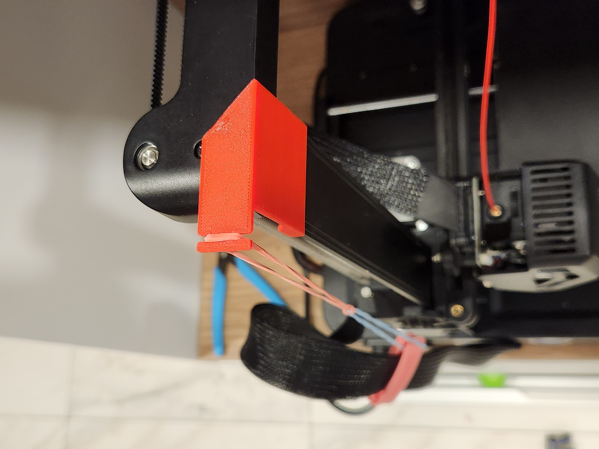

# Side hook for Ender3 V3 SE gantry

[![CC BY 4.0][cc-by-shield]][cc-by]

Side hook for the gantry. Can be used to hang anything.
I use it to suspend extruder cable, as my printer stands
on a narrow shelf next to a passage - to reduce it
being dragged by accident.

* Easy to print
* No additional screws needed
* No support required

## License

This work is licensed under a
[Creative Commons Attribution 4.0 International License][cc-by].

[![CC BY 4.0][cc-by-image]][cc-by]

[cc-by]: http://creativecommons.org/licenses/by/4.0/
[cc-by-image]: https://i.creativecommons.org/l/by/4.0/88x31.png
[cc-by-shield]: https://img.shields.io/badge/License-CC%20BY%204.0-lightgrey.svg
